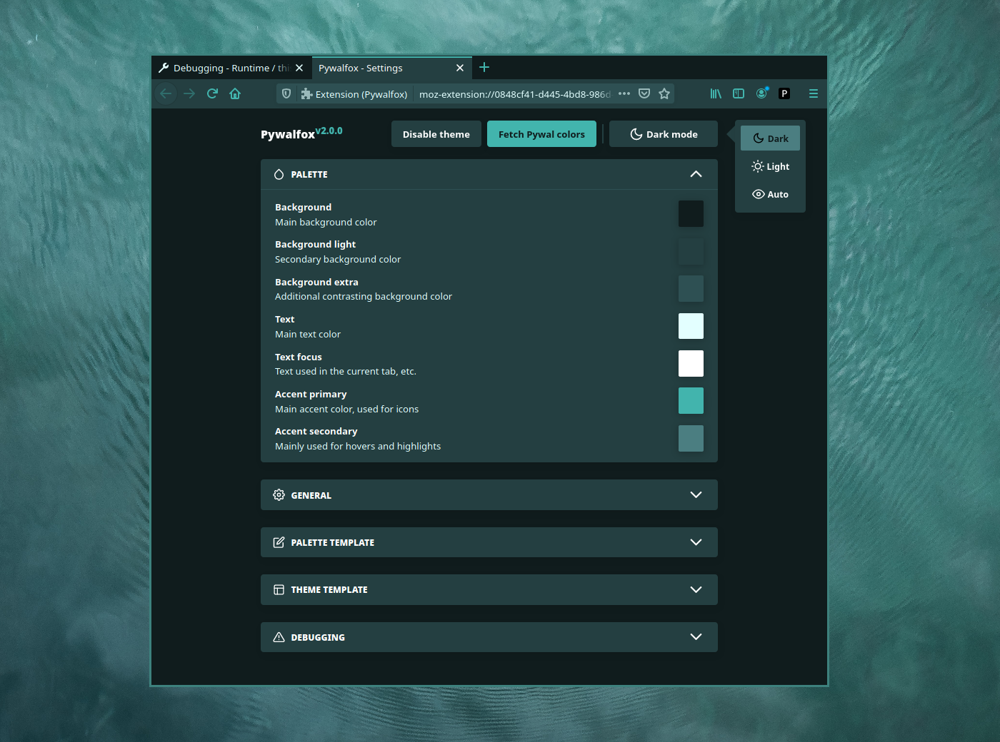
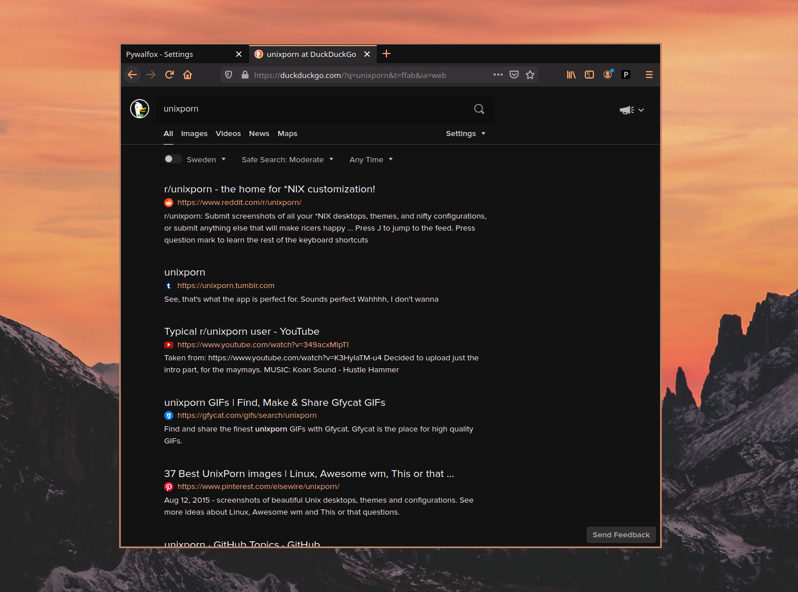
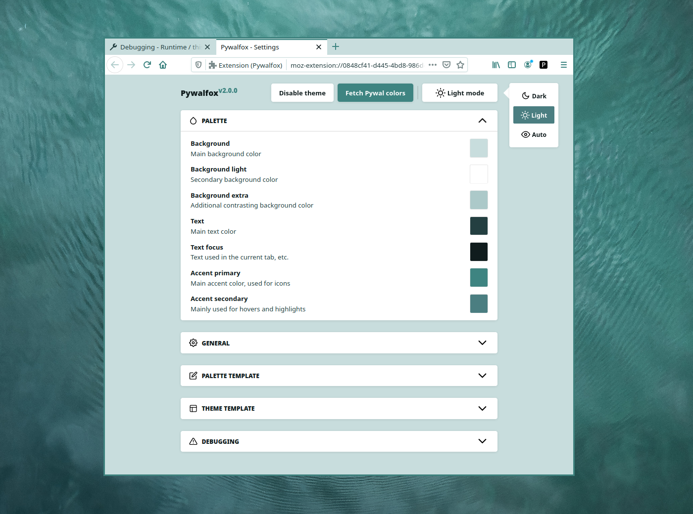
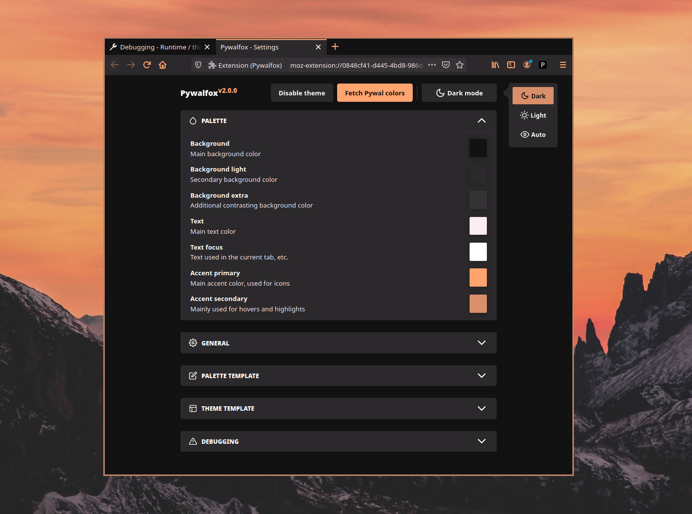

@ascii pywalfox
@wallpaper wallpaper.jpg

> **Dynamic theming of Firefox (and Thunderbird) using your Pywal colors**

  
  
  
  
  

- Tired of Firefox and Thunderbird not respecting your gorgeous Pywal colors like the rest of your system?
- Looking to rack up some karma
@icon arrow-up
on [/r/unixporn](https://reddit.com/r/unixporn)?

Introducing Pywalfox, an add-on for [Firefox](https://addons.mozilla.org/en-US/firefox/addon/pywalfox/) and [Thunderbird](https://addons.thunderbird.net/sv-SE/thunderbird/addon/pywalfox/) that themes the browser with your [Pywal](https://github.com/dylanaraps/pywal) colors using the official [Theme API](https://developer.mozilla.org/en-US/docs/Mozilla/Add-ons/WebExtensions/manifest.json/theme) from Mozilla!

## Features
- [x] Customize the colors of almost every UI element
- [x] Automatically theme DuckDuckGo :duck: searches in Firefox (optional)
- [x] Have bold text, styled dropdowns and much more (optional)
- [x] Easily update the theme using the add-on and/or the command line
- [x] Automatically switch between a dark and a light theme based on the time of day

[Get Pywalfox](https://github.com/Frewacom/Pywalfox#installation)
@icon linux
@icon apple
@icon windows

## Screenshots

